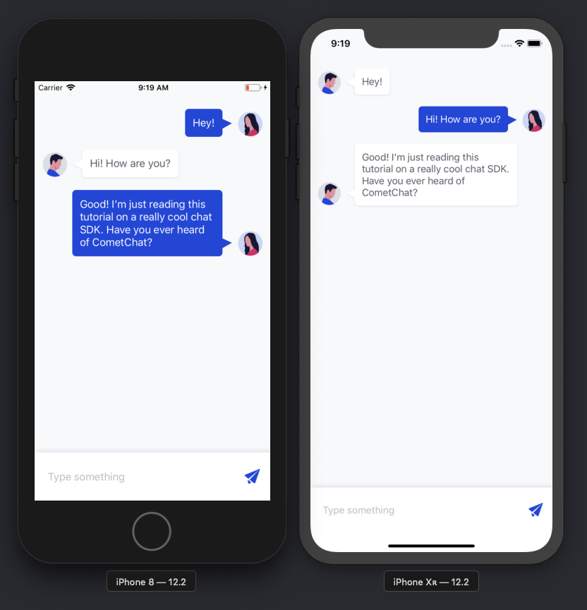

# iOS Chat App Example

Read the full tutorial here:

[**>> Build an iOS chat app with Swift**](https://www.cometchat.com/pro/tutorials/TODO/?utm_source=github&utm_medium=example-code-readme)

This example shows how to build an anonymous group chat with Swift:

## Technology

This demo uses:

* CometChatPro 1.8.5
* Swift 5
* Xcode 10.2.1

## Running the demo

To run the demo follow these steps:

1. [Head to CometChat Pro and create an account](https://cometchat.com/pro?utm_source=github&utm_medium=example-code-readme)
2. From the [dashboard](https://app.cometchat.com/?utm_source=github&utm_medium=example-code-readme), create a new app called "Swift Group Chat"
3. One created, click **Explore**
4. Go to the **API Keys** tab and click **Create API Key**
5. Create an API key called "Kotlin Group Chat Key" with **Full Access**
4. Download the repository [here](https://github.com/cometchat-pro-tutorials/ios-chat-using-swift/archive/master.zip) or by running `git clone https://github.com/cometchat-pro-tutorials/ios-chat-using-swift.git` and open **CometChat.xcworkspace** in Xcode
5. Update the `Constants` in [ChatService.swift](https://github.com/TODO) with your newly-created app ID and API key
6. Run the app and login with one of the test users: superhero1, superhero2, superhero3, superhero4 or superhero5

Questions about running the demo? [Open an issue](https://github.com/cometchat-pro-tutorials/ios-chat-using-swift/issues). We're here to help ✌️

## Useful links

- 🏠 [CometChat Homepage](https://cometchat.com/pro?utm_source=github&utm_medium=example-code-readme)
- 🚀 [Create your free account](https://app.cometchat.com?utm_source=github&utm_medium=example-code-readme)
- 📚 [Documentation](https://prodocs.cometchat.com/docs?utm_source=github&utm_medium=example-code-readme)
- 👾 [GitHub](https://github.com/CometChat-Pro)

